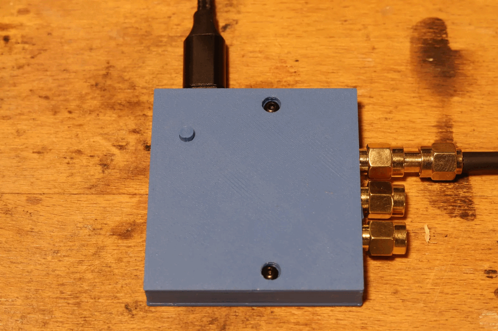
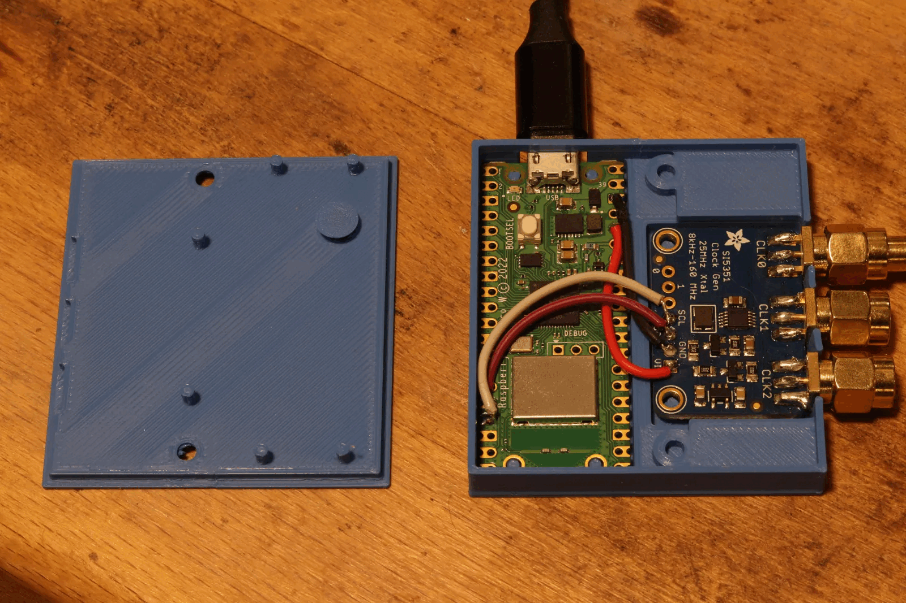

# Web clockgenerator

Web firmware for the Si5351A clock generator on a Raspberry Pi Pico W, featuring a browser user interface.

  
  

## Features
- Configure and output CLK0 frequency and drive strength from the web page, with output enable/disable.
- Morse code at the configured carrier.
- Pico W provides its own WPA2 access point, DHCP server, and USB CDC logs.

## Quick Start
1. Download uf2-file release file and copy to Pico W
2. Join the `clockgen` SSID (`12345678`) and browse to `http://192.168.4.1`.

## Build
1. `export PICO_SDK_PATH=/path/to/pico-sdk`
2. `cmake -S . -B build -DPICO_BOARD=pico_w -DPICO_NO_PICOTOOL=1`
3. `cmake --build build`
4. `./create_uf2.sh build/web_clockgen.uf2` and copy the UF2 to the Pico W in BOOTSEL mode.
5. Join the `clockgen` SSID (`12345678`) and browse to `http://192.168.4.1`.

## Usage
- **Clock Generator**: set frequency/drive, toggle the output, and watch status messages above the form.
- **Morse Playback**: submit 1–20 characters, choose WPM and optional Farnsworth WPM, then Play/Stop; the panel reflects live state.
- USB CDC logs include `[SI5351]` and `[MORSE]` entries for troubleshooting.

## Hardware
- Raspberry Pi Pico W
- Circuit requires only four wires: SDA→GP12, SCL→GP13, VCC→3V3, GND→GND
- Optional printed enclosure parts in [enclosure/](enclosure/) — [Body](enclosure/web_signalgenerator-Body.stl), [Lid](enclosure/web_signalgenerator-lid.stl), [Button](enclosure/web_signalgenerator-Button.stl)

Si5351 driver adapted from [kholia/Si5351-Pi-Pico](https://github.com/kholia/Si5351-Pi-Pico) and [etherkit/Si5351Arduino](https://github.com/etherkit/Si5351Arduino).
