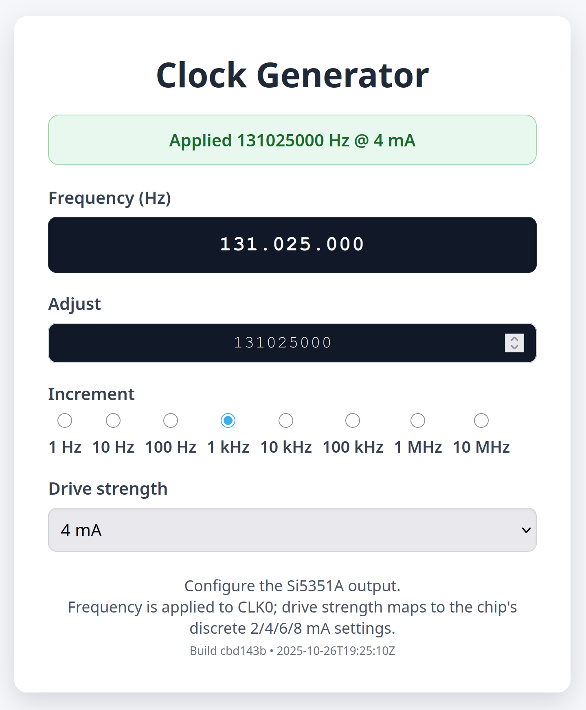

# Web clockgenerator

Web control for a Si5351A via a Pico W. Connect to the access point "clockgen", pwd:"12345678" provided by the Pico. Control the clock generator. 



## Build

1. Install the Pico SDK and point `PICO_SDK_PATH` at it.
   ```bash
   export PICO_SDK_PATH=/path/to/pico-sdk
   ```
2. Configure and build (Pico W target, skip picotool):
   ```bash
   mkdir -p build
   cmake -S . -B build -DPICO_BOARD=pico_w -DPICO_NO_PICOTOOL=1
   cmake --build build
   ```
3. Generate the UF2 and copy it to the Pico W (drive in BOOTSEL mode):
   ```bash
   ./create_uf2.sh build/web_clockgen.uf2
   ```

The firmware exposes a web control page for the Si5351A and logs activity on the USB CDC console.

```
[20:45:31.507] Connected to /dev/ttyACM5
USB connected
[1291 ms] [INFO] Clock generator web firmware booting
[1291 ms] [INFO] [SI5351] controller init requested
[1291 ms] [SI5351] Probing device at 0x60
[1299 ms] [SI5351] Device ready
[1301 ms] [INFO] [SI5351] initialized (freq=1000000 Hz, drive=4 mA)
[2141 ms] [INFO] DHCP server listening on port 67
[2142 ms] [INFO] Webserver listening on port 80
[2142 ms] [INFO] Access point ready: SSID=clockgen, IP=192.168.4.1
[21059 ms] [INFO] [SI5351] CLK0 control=0x0D (requested 4 mA)
[21059 ms] [INFO] [USER] freq=131058000 Hz, drive=4 mA
```
Si5351 driver adapted from [kholia/Si5351-Pi-Pico](https://github.com/kholia/Si5351-Pi-Pico) and
references [etherkit/Si5351Arduino](https://github.com/etherkit/Si5351Arduino).

## Hardware

- Raspberry Pi Pico W (3.3 V logic).
  - Si5351A breakout (e.g. Adafruit, SparkFun) wired as:
  - Pico GP12 → Si5351 SDA
  - Pico GP13 → Si5351 SCL
  - Pico 3V3 → Si5351 VCC / VIN
  - Pico GND → Si5351 GND
  - (optional) Tie Si5351 EN/OE high to 3.3 V.

The firmware programs CLK0 of the Si5351; route that output wherever you need the clock signal.

## Enclosure

Printable enclosure files live in `enclosure/`. The FreeCAD source (`web_signalgenerator.FCStd`) and STL exports for the body, lid, and button support a simple desktop case for the Pico W + Si5351A build.
